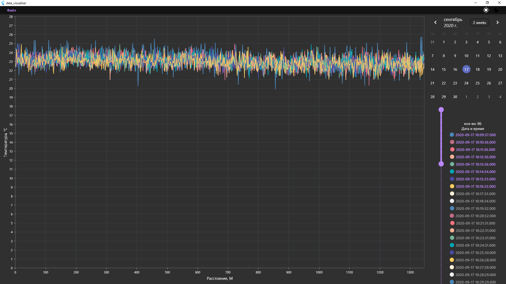

# data_visualizer

Flutter project for data visualization.

For now support only .las files.

Used for presentation data from DTS:

### How to use:
1. Choose file/files/directory (files must be formatted as 17.09.2020 11-26-55 averaged.las)
2. Choose date on calendar.

If you want some additional functionality, you can contact me:
email: ivanivan120@gmail.com
telegram: https://t.me/Ivan97IV